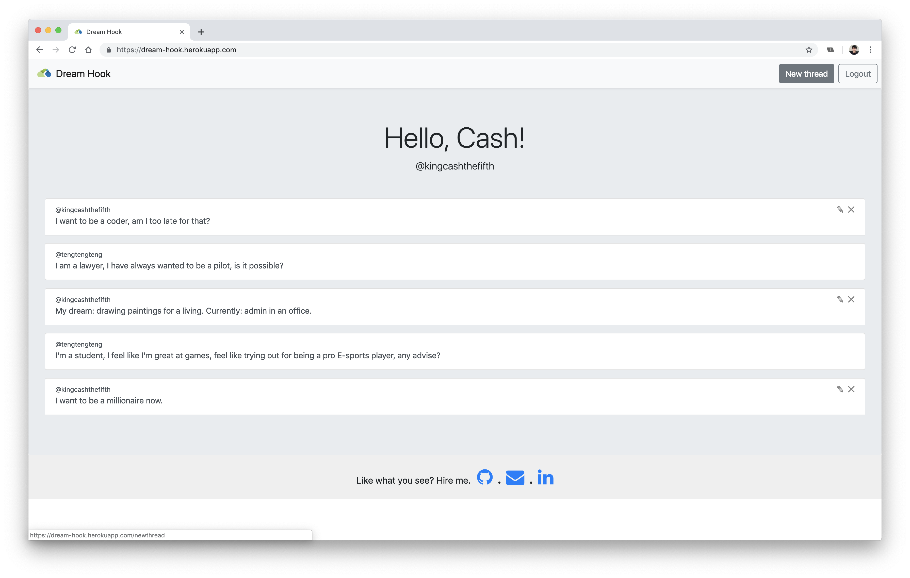

# DreamHook

Try it out **[here](https://developer.mozilla.org/en-US/docs/Web/JavaScript)**!



_Where dream chasers gather._

A forum where career switchers gather to chat and share experiences with one another.

## Features

- Sign up and start creating your own threads!
- Comment on other user's threads or reply to your own threads
- Able to edit and delete your own threads and comments
- Talk about anything under the sun
- You never know how much a **little** advice can make a **big** difference to someone!

## Installation

Install the required dependencies

```
npm i
```

From the root folder in your Terminal, run the script

```
npm start
```

Your local copy of dreamhook should be up and running at http://localhost:3000

## Technologies

- **[Javascript](https://developer.mozilla.org/en-US/docs/Web/JavaScript)** - Main Language
- **[React.js](https://reactjs.org/)** - Frontend Javascript Library
- **[Node.js](https://nodejs.org/en/)** - Javascript runtime environment
- **[PostgreSQL](https://www.postgresql.org/)** - SQL Database
- **[Bootstrap](https://getbootstrap.com/)** - CSS Framework
- **[Express.js](https://expressjs.com/)** - Node Web Application Framework
- **[Heroku](https://heroku.com)** - Deployment
